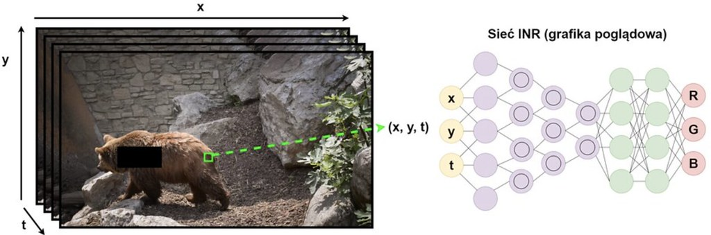

# Reconstructed INR Video Inpainting - Polish AI Olympiad II Final

This repository is a reconstructed reference solution for the final-stage INR video inpainting task in the Polish Artificial Intelligence Olympiad.
It is not the author's original competition submission.

The solution models missing video pixels as a continuous function of normalized x, y, and time coordinates.
It uses Fourier features and a SIREN-style MLP with separate RGB and segmentation-mask heads.
Training samples observed pixels and uses RGB MSE plus mask binary cross-entropy.

*INR illustration referenced by the official Polish AI Olympiad II final notebook.*

## Quick start

Install `requirements.txt`, then run `python -m unittest discover -s tests -v`.

## Validation

The included smoke test verifies coordinate normalization and Fourier feature dimensions.
No public validation metric is reported because the original public data archive is not unpacked or trained here.

## Provenance

The original Polish task notebook is retained as `notebooks/original_submission.ipynb`.
`docs/task_en.md` is an English task summary.
